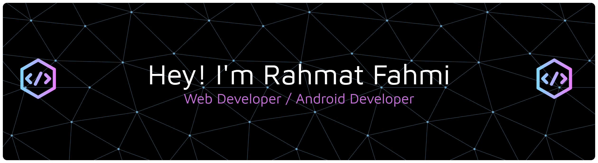

<!-- ## Hi I'm Rahmat Fahmi 👋

 -->

<!-- - 🔭 I am currently studying and looking for experience to work as a web and Android developer.
- 🌱 I am currently deepening my knowledge to use the **Laravel framework**, **Java** and **Kotlin**

##### Teach Stack 

    

##### Mobile Framework

##### Framework & Library

##### Database

##### IDE

##### OS

##### Social

 

##### Terminal

##### My Github Stats

 -->

<h2 align="left">Hey 👋 What's up?</h2>

###

<h5 align="left">About me</h5>

###

- 🔭 I am currently studying and looking for experience to work as a web and Android developer. - 🌱 I am currently deepening my knowledge to use the Laravel framework, Java and Kotlin

###

<h5 align="left">Skills</h5>

###

   
   
   
   
   
  

###

<h5 align="left">Mobile Framework</h5>

###

  

###

<h5 align="left">Framework & Library</h5>

###

   
  

###

<h5 align="left">Database</h5>

###

   
  

###

<h5 align="left">Tools & Environment</h5>

###

   
  

###

<h5 align="left">Version Control</h5>

###

   
  

###

<h5 align="left">Social Media</h5>

###

  
  

##### My Github Stats

###

<picture>
  <source media="(prefers-color-scheme: dark)" srcset="https://raw.githubusercontent.com/rahmatfahmi/rahmatfahmi/output/pacman-contribution-graph-dark.svg">
  <source media="(prefers-color-scheme: light)" srcset="https://raw.githubusercontent.com/rahmatfahmi/rahmatfahmi/output/pacman-contribution-graph.svg">
  
</picture>

###

###
